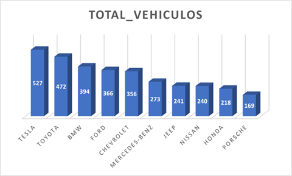
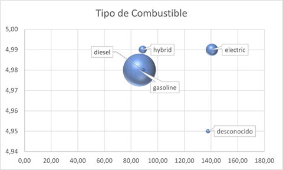
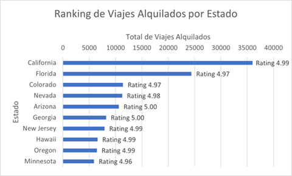

# Car Rental Data Pipeline - End-to-End Project

This project implements a complete Big Data pipeline for a car rental platform. It automates the extraction of raw data, its transformation using distributed computing, and the generation of business insights for decision-making.

## 🚀 Project Overview
The goal of this project is to process car rental data to analyze fleet performance, customer preferences, and eco-friendly vehicle adoption. 

## 🛠 Architecture & Technologies
The pipeline follows a modern Big Data architecture:

* **Data Ingestion Layer:** Uses **Bash** scripts for automated data retrieval from cloud storage (AWS S3) to **HDFS**, implementing pre-processing validation checks.
* **Transformation Engine:** Leverages **PySpark** for distributed processing, focusing on data quality (handling nulls/empty values) and business-rule filtering, concluding with the automated data load into Apache Hive tables.
* **Workflow Management:** Orchestrated by **Apache Airflow**, ensuring a resilient and schedulable end-to-end pipeline from raw data to final insights.
* **Analytical Storage:** Employs **Apache Hive** as the Data Warehouse layer, organizing processed vehicle data into structured tables for efficient SQL reporting.

## 🛠️ Tech Stack


## 📂 Project Structure
```text
├── dags/                            # Airflow DAGs (Parent/Child orchestration)                
│   ├── child_rental.py      
│   └── parent_rental.py
├── reports/                         # Visualizations
│   ├── fuel_type.png
│   ├── total_cars.png
│   └── trips_per_state.png
├── scripts/                         # Core logic and processing
│   ├── ingest-rental.sh             # Bash Ingestion Script                  
│   └── rental_load.py               # PySpark Transformation Engine   
├── sql/                             # SQL Layer
│   ├── ddl/          
│   │   └── hive_tables.hql          # Table schemas and definitions  
│   └── queries/
│       └── analysis_queries.sql     # Business Intelligence queries
├── .gitignore
├── LICENSE
└── README.md
```

## 📊 Business Insights & Visualizations
The following insights represent the final stage of the pipeline, where raw data is transformed into strategic decision-making tools.

### 1. Total Fleet Activity Analysis

* **Strategic Value:** This visualization highlights inventory concentration by brand. It identifies the dominant manufacturers in the fleet, allowing for targeted partnership strategies and inventory optimization.

### 2. Fuel Type Positioning Analysis

* **Strategic Value:** Analyzes the correlation between customer experience (**Rating**) and profitability (**Price**) segmented by fuel technology. This helps the business understand which engine types offer the best balance of user satisfaction and revenue.

### 3. State Performance Ranking

* **Strategic Value:** Ranks states by business volume (total trips) while integrating a quality metric (Average Rating). This multi-dimensional view identifies not just where we rent the most, but where we provide the best service.

## 💡 Executive Summary & Strategic Recommendations

### 1. Key Conclusions
* **Fleet Composition:** The inventory is highly concentrated in two manufacturers: **Tesla and Toyota**. This reflects a dual strategy balancing premium electric technology with high operational reliability.
* **Market Positioning (Price vs. Quality):**
    * **Premium Segment (Electric):** These vehicles represent the most profitable asset class, with the highest daily price (≈$140 USD) and peak quality ratings (4.99).
    * **Volume Segment (Gasoline):** Remains the operational pillar, offering competitive pricing (≈$86 USD) while maintaining excellent service quality (4.98).
    * **Critical Risk (Unknown Fuel Type):** Data reveals a high-risk gap; these vehicles are priced high but hold the lowest quality ratings in the entire fleet (4.95).
* **Geographic Performance:** Business volume is heavily concentrated in **California and Florida**, which act as the primary revenue engines for the platform.

### 2. Strategic Recommendations
* **Data Integrity & Investigation:** Launch an immediate audit of the 'Unknown' fuel category. Identifying these vehicles is crucial to understand why they are underperforming in customer satisfaction despite their high rental price.
* **Operational Health KPI:** Establish a priority alert system if the **Average Rating** for the Gasoline fleet in key states falls below **4.97**. Given its role as the fleet's foundation, any dip in quality here poses a significant risk to overall business stability.

---
*Developed by a Data Engineering Specialist.*
